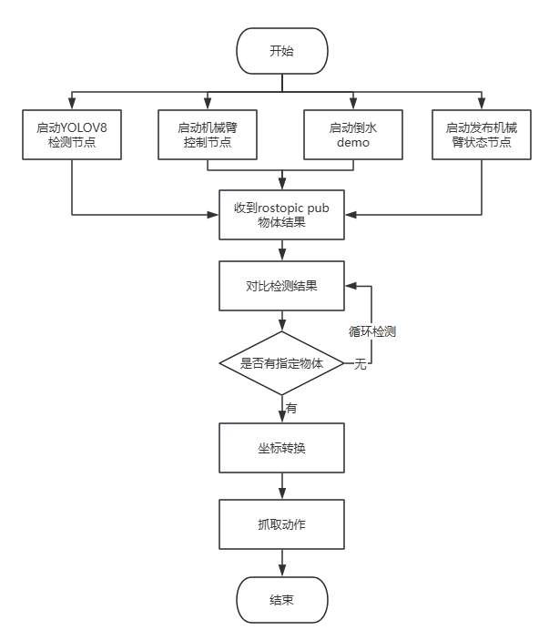

# YOLOV8 Visual Recognition Function Package Instructions for Use

## 1.Project Overview

As an indispensable execution unit in current social production, robotic arms have been integrated into our various production lives. How to make robotic arms perform tasks more intelligently is a continuous goal to improve production efficiency and intelligentize production. Therefore, this project is Adding "eyes" to the robotic arm increases the perceived information of the robotic arm, and gives the "eyes" the ability to identify information about the surrounding environment to improve its intelligence in execution and provide a basis for subsequent integration of robots to complete automated production tasks.


### 1.1Project background

Robots are mostly used as actuators in traditional applications. For example, a robotic arm sequentially operates workpieces in a fixed posture on an assembly line. This requires that its posture setting must be very precise and strict, and any deviation during the work process will disrupt it. The entire process resulted in huge losses. In order for the robot to operate the target object more intelligently, it is necessary to give the robot vision. Traditional industrial cameras can provide information such as the outline and color of the object, which meets some factory production conditions. However, because it cannot understand the semantic information of the object, it leads to It is impossible to leave the factory to provide smart services for daily life.

The emergence of deep learning accelerates robots' image understanding. Based on various algorithms, advanced semantic information can be obtained from two-dimensional images, which greatly helps robots understand the surrounding environment. YOLOv8 (You Only Look Once version 8) is a deep learning framework for real-time object detection. It is the latest iteration of the YOLO series and is designed to provide greater accuracy and speed. Its characteristics are as follows:

-  **Real-time performance**: YOLOv8 continues to maintain the real-time detection characteristics of the YOLO series and can achieve high frame rates (FPS) even on lower hardware configurations.
-  **High Accuracy**: Through a deeper and more complex network structure and improved training techniques, YOLOv8 greatly improves detection accuracy while maintaining high speed.
- **Multi-Scale Prediction**: YOLOv8 introduces improved multi-scale prediction technology for better detection of objects of different sizes.
- **Adaptive anchor box**: The new version has been optimized in adaptively adjusting the anchor box, which can more accurately predict the position and size of objects.

Empowering robots through YOLOV8 is a common practice in the current process of robot intelligence. As the most widely used robot operating system at present, the ROS operating system can decentralize computer vision and voice based on its point-to-point design and mechanisms such as service and node managers. The real-time computing pressure brought by functions such as recognition can adapt to the challenges encountered by multiple robots. Based on the above background, the visual function package of YOLOV8 was produced to facilitate developers to obtain visual information in ROS.

### 1.2Main Goal

- **Visual recognition function integration**: Integrate the visual recognition algorithm with the robotic arm execution function to complete information exchange.
- **Intelligent Execution**: Using visual recognition information, let the robotic arm move to the specified position and grab the specified object.

### 1.3 core functions

- **Visual recognition object information release**: Publish the object information obtained through the visual recognition algorithm through the ROS topic to facilitate users to call it directly.
- **Multiple types of trajectory execution**: The robotic arm has multiple trajectory planning algorithms, which can allow the robotic arm to reach the target point through different movement methods and protect the equipment from damage.

### 1.4 technical highlights

-  **High-Performance Robotic Arm**: With its 6 degrees of freedom and 5kg load capacity, the Realman RM65 robotic arm provides a wide operating range and high-precision operating capabilities.
-  **ROS-based software architecture**: Use the ROS noetic version to build a modular and scalable software system that supports secondary development and function expansion.

### 1.5 application prospects

This visual recognition and grabbing system can be quickly integrated into various types of robots to facilitate the completion of functional requirements in designated scenarios such as unmanned supermarkets and smart agriculture.

### 1.6 change log

| Update date | Update content | Version number |
| :--------: | :----------------------: | :----: |
| 2024/12/27 | YOLOV8 visual recognition function package released | v1.0.0 |

## 2. Software and hardware overview

### 2.1 project structure

The YOLOV8 visual recognition function package is developed based on RM products. It uses YOLOV8 and D435 cameras to visually identify objects, obtain the three-dimensional coordinates of the object, and finally let the RM robot arm complete a grabbing action. To use this function package, you only need to add it to the function package of the original RM product. It can be used after the compilation is passed. It provides a demo of a single robot arm grabbing a water bottle and pouring water.

```
​```
│ requirements.txt //Function package depends on the environment
│ YOLOV8 visual recognition function package usage instructions.md
│
├─pic
│ 435 test screen.png
│ grab.png
│ Crawl process.png
│ Hardware connection.jpg
│ Vision Arm.png
│
├─rm_robot //Robot arm ROS package, please refer to the robot arm section for details
│
├─vi_grab //Visual grabbing function package
│  │  CMakeLists.txt
│  │  package.xml
│  │
│ ├─include
│  │  └─vi_grab
│ ├─launch
│ │ vi_grab_demo.launch //Visual grab demo startup file
│  │
│ ├─model
│ ├─scripts
│  │  │  LICENSE
│ │ │ pub.py
│ │ │ vision_grab.py //Visual grabbing execution file
│ │ │ vision_pour_water_modbus.py
│ │ │ vi_catch_yolov8.py //YOLOV8 visual detection ROS release node
│  │  │
│  │  └─.idea
│  │      │  .gitignore
│  │      │  .name
│  │      │  misc.xml
│  │      │  modules.xml
│  │      │  scripts.iml
│  │      │  vcs.xml
│  │      │  workspace.xml
│  │      │
│ │ └─inspectionProfiles
│  │              profiles_settings.xml
│  │              Project_Default.xml
│  │
│ └─src
└─vi_msgs
│  CMakeLists.txt
│  package.xml
    │
├─include
│ └─vi_msgs
├─msg
│ ObjectInfo.msg //YOLOV8 detects object topic message type
    │
└─src

\```
```

### 2.2 hardware configuration

The hardware adopts RM65 series robotic arm, intel realsense D435 camera and Yinshi EG2-4C2 two-finger electric gripper. The robotic arm can be RM65-B version with vision adapter board, or RM65-B-V vision version robotic arm (as shown below) , the internal wiring is integrated with a D435 camera), and the main control can be a PC with arm or X86 architecture.


The robotic arm is connected to the main control through a network cable, the camera is connected to the USB interface of the main control through a data cable, and the gripper is connected to the end of the robotic arm through a special end interface cable made by RM. The communication interface at the end of the RM robot arm is a 6-core connector that provides power and control signals to different grippers and sensors connected to the robot. Therefore, different end effectors can be replaced. Please refer to the RM Robot Arm Secondary Development Manual when integrating.


## 3. Function package test environment

### 3.1.ROS noetic environment

For ROS environment installation, please refer to: [ROS的最简单安装——鱼香一键安装_鱼香ros一键安装-CSDN博客](https://blog.csdn.net/m0_73745340/article/details/135281023)

```
wget http://fishros.com/install -O fishros && . fishros
```

### 3.2.Ubuntu20.04 system

This function package example uses jetson xariver NX and cuda with jatpack installed.

To flash Jetson NX and install cuda and other deep learning environments, please refer to [英伟达官方源Jetson Xavier NX安装Ubuntu20.04，配置CUDA，cuDNN，Pytorch等环境教程](https://blog.csdn.net/m0_53717069/article/details/128536837)

### 3.3.YOLOV8 dependency requirements

YOLOV8's official requirement for python version is 3.8 or above, so after installing the basic environment, you need to establish a python3.8 environment (it can be a conda virtual environment, or you can use the system's own 3.8 environment)

After setting up the python3.8 environment, perform the following steps in this environment, open the terminal under src, and install the python third-party library according to requirements.txt

```
pip3 install -r requirements.txt
```

```
pip3 install ultralytics
```

### 3.4.RealSense D435 driver and pyrealsense2

1. Register the public key of the server

```
sudo apt-get update && sudo apt-get upgrade && sudo apt-get dist-upgrade
sudo apt-key adv --keyserver keyserver.ubuntu.com --recv-key F6E65AC044F831AC80A06380C8B3A55A6F3EFCDE || sudo apt-key adv --keyserver hkp://keyserver.ubuntu.com:80 --recv-key F6E65AC044F831AC80A06380C8B3A55A6F3EFCDE
```

2. Add the server to the repository list

```
sudo add-apt-repository "deb https://librealsense.intel.com/Debian/apt-repo $(lsb_release -cs) main" -u
```

3.Install SDK2

```
sudo apt-get install librealsense2-dkms
sudo apt-get install librealsense2-utils
```

This step may report an error on the arm architecture. If no error is reported, you can directly enter the testing realsense-viewer step. If an error is reported, you can use the source code installation method. First download the source code and install the necessary libraries.

```
git clone https://github.com/IntelRealSense/librealsense.git
sudo apt-get install libusb-1.0-0-dev libglfw3-dev libgtk-3-dev
```

Then go into that directory and run the following commands to install and compile the dependencies:

```
sudo apt-get install libudev-dev pkg-config libgtk-3-dev
sudo apt-get install libusb-1.0-0-dev pkg-config
sudo apt-get install libglfw3-dev
sudo apt-get install libssl-dev

sudo cp config/99-realsense-libusb.rules /etc/udev/rules.d/
sudo udevadm control --reload-rules && udevadm trigger 
mkdir build
cd build
cmake ../ -DBUILD_EXAMPLES=true
make
sudo make install
```

4. Test the installation results

```
realsense-viewer
```


5. Install pyrealsense2

```
python -m pip install --upgrade pip
pip install pyrealsense2 -i https://pypi.tuna.tsinghua.edu.cn/simple/
```

## 4.Test steps

1. First confirm whether the ROS function package of the robotic arm can be used normally, because there is a corresponding relationship between the ROS function package and the version of the robotic arm. You can enter [realman资料官网](https://develop.realman-robotics.com/robot/summarize/) to view the specific version corresponding information. If there is a problem with the ROS package, please download the latest ROS package from the official website and replace rm_robot in the src directory.

```
sudo apt-get update    # 更新在线包列表
sudo apt-get install python-catkin-tools    # 安装catkin
```

```
mkdir -p rm_work    # 创建功能包
cd rm_work    # 进入工作空间目录
```

Unzip the downloaded src and put it in the rm_work directory

2. Compile vi_msgs, rm_msgs

```
catkin build vi_msgs rm_msgs
```

The object information defined by ObjectInfo under vi_msgs is as follows

```
string object_class                //物体类别
float64 x                          //物体距离相机坐标系的X轴值
float64 y                          //物体距离相机坐标系的Y轴值
float64 z                          //物体距离相机坐标系的Z轴值
```

3. Compile the overall function package

```
catkin build 
```

4. Run vi_grab_demo.launch

A total of four nodes are started in vi_grab_demo.launch, namely msg_pub (actively obtains the status of the robot arm), robot_driver (activation of the robot arm function), object_detect (visual recognition information release), and object_catch (grab task script).

```
# 声明环境变量
source devel/setup.bash 
# 运行launch文件
roslaunch vi_grab vi_grab_demo.launch 
```

5. Publish the objects that need to be grabbed

Before releasing the object information, you need to manually teach the robot arm to the initial position, because the grabbing logic is to identify the object in the current robot arm state and grab the object according to the current end posture, which means that the robot arm needs to be as close as possible Keep the end position level.

Open the terminal and publish the name of the object you want to grab (using the coco model) through rostopic pub. For example, grab a water bottle.

```
rostopic pub /choice_object std_msgs/String "bottle"
```

6. The robotic arm receives the information that it needs to grab the object and begins to execute the motion logic in the vision_grab.py file. The following is the logic flow chart




## 5. Key code analysis

The visual function package establishes a ROS node for publishing the visual recognition results of YOLOV8. Users can conduct a variety of secondary developments based on this node. They only need to put the function package into the original workspace. In the RM product, we subscribe to the object information topic and convert the object information into the coordinate system of the RM robot arm to complete functions such as visual grabbing.

### 5.1Visual identification and information release

```
model_path = os.path.join('model', 'yolov8n.pt')
model = YOLO('model_path')  #通过加载不同的模型，使用yolov8的不同模式，例如yolov8n-pose.pt是人体姿态识别模式，yolov8n.pt是普通检测框模式
rospy.init_node("object_detect",anonymous=True)   #建立ROS节点
object_pub = rospy.Publisher("object_pose",ObjectInfo,queue_size=10)   #定义话题发布器
# 循环检测图像流
try:
    while True:
        # 等待获取一对连续的帧：深度和颜色
        intr, depth_intrin, color_image, depth_image, aligned_depth_frame = get_aligned_images()
        if not depth_image.any() or not color_image.any():
            continue
        # 使用 YOLOv8 进行目标检测
        results = model.predict(color_image, conf=0.5)
        detected_boxes = results[0].boxes.xyxy  # 获取边界框坐标
        data = results[0].boxes.data.cpu().tolist()
        canvas = results[0].plot()

        for i, (row, box) in enumerate(zip(data, detected_boxes)):
            id = int(row[5])
            name = results[0].names[id]
            x1, y1, x2, y2 = map(int, box)  # 获取边界框坐标
            # 显示中心点坐标
            ux = int((x1 + x2) / 2)
            uy = int((y1 + y2) / 2)
            dis, camera_coordinate = get_3d_camera_coordinate([ux, uy], aligned_depth_frame, depth_intrin) #得到中心点的深度值，当作距离

            formatted_camera_coordinate = f"({camera_coordinate[0]:.2f}, {camera_coordinate[1]:.2f},{camera_coordinate[2]:.2f})"
            # 展示检测界面
            cv2.circle(canvas, (ux, uy), 4, (255, 255, 255), 5)
            cv2.putText(canvas, str(formatted_camera_coordinate), (ux + 20, uy + 10), 0, 1,
                        [225, 255, 255], thickness=2, lineType=cv2.LINE_AA)
            # ROS话题发送物体坐标
            object_info_msg.object_class = str(name)
            object_info_msg.x = float(camera_coordinate[0])
            object_info_msg.y = float(camera_coordinate[1])
            object_info_msg.z = float(camera_coordinate[2])
            rospy.loginfo(object_info_msg)
            object_pub.publish(object_info_msg)

        cv2.namedWindow('detection', flags=cv2.WINDOW_NORMAL |
                                               cv2.WINDOW_KEEPRATIO | cv2.WINDOW_GUI_EXPANDED)
        cv2.imshow('detection', canvas)
        key = cv2.waitKey(1)
        # 按下 esc 或者 'q' 退出程序和图像界面
        if key & 0xFF == ord('q') or key == 27:
            cv2.destroyAllWindows()
            break 
finally:
    # 关闭相机图像流
    pipeline.stop()
```

### 5.2 Coordinate conversion

The three-dimensional coordinates of the object in the camera coordinate system are converted to the coordinate function in the robot arm base coordinate system:

```
def convert(x,y,z,x1,y1,z1,rx,ry,rz):
    """
    函数功能：我们需要将旋转向量和平移向量转换为齐次变换矩阵，然后使用深度相机识别到的物体坐标（x, y, z）和
    机械臂末端的位姿（x1,y1,z1,rx,ry,rz）来计算物体相对于机械臂基座的位姿（x, y, z, rx, ry, rz）
    输入参数：深度相机识别到的物体坐标（x, y, z）和机械臂末端的位姿（x1,y1,z1,rx,ry,rz）
    返回值：物体在机械臂基座坐标系下的位置（x, y, z）
    """
    global rotation_matrix,translation_vector
    obj_camera_coordinates = np.array([x, y, z])

    # 机械臂末端的位姿，单位为弧度
    end_effector_pose = np.array([x1, y1, z1,
                                  rx, ry, rz])
    # 将旋转矩阵和平移向量转换为齐次变换矩阵
    T_camera_to_end_effector = np.eye(4)
    T_camera_to_end_effector[:3, :3] = rotation_matrix
    T_camera_to_end_effector[:3, 3] = translation_vector
    # 机械臂末端的位姿转换为齐次变换矩阵
    position = end_effector_pose[:3]
    orientation = R.from_euler('xyz', end_effector_pose[3:], degrees=False).as_matrix()
    T_base_to_end_effector = np.eye(4)
    T_base_to_end_effector[:3, :3] = orientation
    T_base_to_end_effector[:3, 3] = position
    # 计算物体相对于机械臂基座的位姿
    obj_camera_coordinates_homo = np.append(obj_camera_coordinates, [1])  # 将物体坐标转换为齐次坐标
    #obj_end_effector_coordinates_homo = np.linalg.inv(T_camera_to_end_effector).dot(obj_camera_coordinates_homo)
    obj_end_effector_coordinates_homo = T_camera_to_end_effector.dot(obj_camera_coordinates_homo)
    obj_base_coordinates_homo = T_base_to_end_effector.dot(obj_end_effector_coordinates_homo)
    obj_base_coordinates = obj_base_coordinates_homo[:3]  # 从齐次坐标中提取物体的x, y, z坐标
    # 计算物体的旋转
    obj_orientation_matrix = T_base_to_end_effector[:3, :3].dot(rotation_matrix)
    obj_orientation_euler = R.from_matrix(obj_orientation_matrix).as_euler('xyz', degrees=False)
    # 组合结果
    obj_base_pose = np.hstack((obj_base_coordinates, obj_orientation_euler))
    obj_base_pose[3:] = rx,ry,rz
    return obj_base_pose
```

Waiting to receive the choice_object topic information. If no information has been published to the choice_object topic, continue to wait.

```
object_msg = rospy.wait_for_message('/choice_object', String, timeout=None)
```

### 5.3 callback function

After receiving the specified grab object signal, enter the callback function. If it matches the specified object, enter the catch grabbing logic.

```
def object_pose_callback(data):
    """
    函数功能：每帧图像经过识别后的回调函数，若有抓取指令，则判断当前画面帧中是否有被抓物体，如果有则将物体坐标进行转换，并让机械臂执行抓取动作
    输入参数：无
    返回值：无
    """

    # 判断当前帧的识别结果是否有要抓取的物体
    if data.object_class == object_msg.data and len(object_msg.data) > 0 :

        # 等待当前的机械臂位姿
        arm_pose_msg = rospy.wait_for_message("/rm_driver/Arm_Current_State", Arm_Current_State, timeout=None)
        print(arm_pose_msg)
        rospy.sleep(1)
        # 等待接收当前机械臂位姿四元数形式
        arm_orientation_msg = rospy.wait_for_message("/rm_driver/ArmCurrentState", ArmState, timeout=None)
        print(arm_orientation_msg)
        # 计算机械臂基坐标系下的物体坐标
        result = convert(data.x,data.y,data.z,arm_pose_msg.Pose[0],arm_pose_msg.Pose[1],arm_pose_msg.Pose[2],arm_pose_msg.Pose[3],arm_pose_msg.Pose[4],arm_pose_msg.Pose[5])
        print(data.object_class,':',result)
        # 抓取物体
        catch(result,arm_orientation_msg)
        # 清除object_msg的信息，之后二次发布抓取物体信息可以再执行
        object_msg.data = ''
```

### 5.4 crawl logic

In the grabbing logic, the execution trajectory of the robotic arm needs to be segmented according to the target position. For example, the first segment should be when the robotic arm reaches the front of the object first, and the second segment is when it grabs. This can avoid collision between the trajectory and the object. In the code The first movejp_type reaches 7 cm in front of the object (assuming the object is in the negative direction of the X-axis of the robot base coordinate system)

```
def catch(result,arm_orientation_msg):
    '''
    函数功能：机械臂执行抓取动作
    输入参数：经过convert函数转换得到的‘result’和机械臂当前的四元数位姿‘arm_orientation_msg’
    返回值：无
    '''
    # 上一步通过pic_joint运动到了识别较好的姿态，然后就开始抓取流程
    # 流程第一步：经过convert转换后，得到了机械臂坐标系下的物体位置坐标result，通过movej_p运动到result目标附近，因为不能一下就到达
    movejp_type([result[0]-0.07,result[1],result[2],arm_orientation_msg.Pose.orientation.x,arm_orientation_msg.Pose.orientation.y,
                 arm_orientation_msg.Pose.orientation.z,arm_orientation_msg.Pose.orientation.w],0.3)
    print('*************************catching  step1*************************')

    # 抓取第二步：通过抓取第一步已经到达了物体前方，后续使用movel运动方式让机械臂直线运动到物体坐标处
    movel_type([result[0],result[1],result[2],arm_orientation_msg.Pose.orientation.x,arm_orientation_msg.Pose.orientation.y,
                 arm_orientation_msg.Pose.orientation.z,arm_orientation_msg.Pose.orientation.w],0.3)
    print('*************************catching  step2*************************')

    # 抓取第三步：到达目标处，闭合夹爪
    gripper_close()
    print('*************************catching  step3*************************')

    # 倒水第一步：抬起物体5厘米
    movel_type([result[0],result[1],result[2]+0.05,arm_orientation_msg.Pose.orientation.x,arm_orientation_msg.Pose.orientation.y,
                 arm_orientation_msg.Pose.orientation.z,arm_orientation_msg.Pose.orientation.w],0.3)
    print('*************************pour  step1*************************')

    # 倒水第二步：旋转机械臂末端关节,通过给机械臂末端关节添加转动弧度达到倒水的动作示例
    movej_type([arm_orientation_msg.joint[0],arm_orientation_msg.joint[1],arm_orientation_msg.joint[2],arm_orientation_msg.joint[3],
                arm_orientation_msg.joint[4],arm_orientation_msg.joint[5]+1],0.3)
    print('*************************pour  step2*************************')
```


## 6.Update steps

The entire project is divided into two parts, one is the robotic arm ROS part, and the other is the visual inspection part. The overall logic of the project is to use the robotic arm ROS part in the visual inspection part to control the robotic arm to complete a series of movements based on vision. Since there is a corresponding relationship between the robot arm software version and the ROS package version, when the robot arm hardware version is updated, the ROS package may not be used normally. At this time, the ROS package in the project needs to be updated.

The update steps are:

```
1、官网下载最新的机械臂ROS包

2、替换工程中的rm_robot文件夹

3、重新编译rm_robot

4、将vision_grab脚本中的机械臂控制话题改为和最新的机械臂ROS包中一致

5、运行测试
```


# FAQ

## 1.Network communication problem


This error will result in the inability to read the current status information of the robotic arm through the topic, so it cannot be ignored. Network settings should be modified.

For example, when using this demo on a virtual machine and using NAT connection mode, UDP will not be able to report data. When the virtual machine uses NAT mode, since the virtual machine and the host are connected through address translation mode, at this time, An address translation table is maintained in the host, so the virtual machine can access the external network through the host. The external network needs to use the address translation table to find the virtual machine. The address translation table will be updated because it needs to unoccupy some ports, so when the wait time is too long, the address translation table has been updated and the UDP packet cannot be sent to the correct address, so it will As a result, the client UDP cannot receive data normally.

Therefore, when using a virtual machine, you need to set the network mode to bridge mode to receive UDP data.

## 2. Crawl problem

If in actual use, it is found that the grasp is inaccurate, the reason can be judged from two aspects. One is whether the hand-eye calibration result is correct, and the other is whether the object coordinates are correct. For example, during recognition, due to the model and light, it will cause the recognition The situation where the coordinates are 0, 0, 0 occurs, so the solved position of the robotic arm will definitely be incorrect. Therefore, it is necessary to ensure that the object recognition has a good effect in the initial posture.


## 5.关键代码解析

视觉功能包是建立了一个ROS节点，用于发布YOLOV8的视觉识别结果，用户可以基于此节点进行多种二次开发，只需要将功能包放入原先的工作空间即可。在RM产品中，我们通过订阅物体信息话题，将物体信息转换到RM机械臂的坐标系下，完成视觉抓取等功能。

### 5.1视觉识别及信息发布

```
model_path = os.path.join('model', 'yolov8n.pt')
model = YOLO('model_path')  #通过加载不同的模型，使用yolov8的不同模式，例如yolov8n-pose.pt是人体姿态识别模式，yolov8n.pt是普通检测框模式
rospy.init_node("object_detect",anonymous=True)   #建立ROS节点
object_pub = rospy.Publisher("object_pose",ObjectInfo,queue_size=10)   #定义话题发布器
# 循环检测图像流
try:
    while True:
        # 等待获取一对连续的帧：深度和颜色
        intr, depth_intrin, color_image, depth_image, aligned_depth_frame = get_aligned_images()
        if not depth_image.any() or not color_image.any():
            continue
        # 使用 YOLOv8 进行目标检测
        results = model.predict(color_image, conf=0.5)
        detected_boxes = results[0].boxes.xyxy  # 获取边界框坐标
        data = results[0].boxes.data.cpu().tolist()
        canvas = results[0].plot()

        for i, (row, box) in enumerate(zip(data, detected_boxes)):
            id = int(row[5])
            name = results[0].names[id]
            x1, y1, x2, y2 = map(int, box)  # 获取边界框坐标
            # 显示中心点坐标
            ux = int((x1 + x2) / 2)
            uy = int((y1 + y2) / 2)
            dis, camera_coordinate = get_3d_camera_coordinate([ux, uy], aligned_depth_frame, depth_intrin) #得到中心点的深度值，当作距离

            formatted_camera_coordinate = f"({camera_coordinate[0]:.2f}, {camera_coordinate[1]:.2f},{camera_coordinate[2]:.2f})"
            # 展示检测界面
            cv2.circle(canvas, (ux, uy), 4, (255, 255, 255), 5)
            cv2.putText(canvas, str(formatted_camera_coordinate), (ux + 20, uy + 10), 0, 1,
                        [225, 255, 255], thickness=2, lineType=cv2.LINE_AA)
            # ROS话题发送物体坐标
            object_info_msg.object_class = str(name)
            object_info_msg.x = float(camera_coordinate[0])
            object_info_msg.y = float(camera_coordinate[1])
            object_info_msg.z = float(camera_coordinate[2])
            rospy.loginfo(object_info_msg)
            object_pub.publish(object_info_msg)

        cv2.namedWindow('detection', flags=cv2.WINDOW_NORMAL |
                                               cv2.WINDOW_KEEPRATIO | cv2.WINDOW_GUI_EXPANDED)
        cv2.imshow('detection', canvas)
        key = cv2.waitKey(1)
        # 按下 esc 或者 'q' 退出程序和图像界面
        if key & 0xFF == ord('q') or key == 27:
            cv2.destroyAllWindows()
            break 
finally:
    # 关闭相机图像流
    pipeline.stop()
```

### 5.2坐标转换

物体在相机坐标系下的三维坐标转换到机械臂基坐标系下的坐标函数：

```
def convert(x,y,z,x1,y1,z1,rx,ry,rz):
    """
    函数功能：我们需要将旋转向量和平移向量转换为齐次变换矩阵，然后使用深度相机识别到的物体坐标（x, y, z）和
    机械臂末端的位姿（x1,y1,z1,rx,ry,rz）来计算物体相对于机械臂基座的位姿（x, y, z, rx, ry, rz）
    输入参数：深度相机识别到的物体坐标（x, y, z）和机械臂末端的位姿（x1,y1,z1,rx,ry,rz）
    返回值：物体在机械臂基座坐标系下的位置（x, y, z）
    """
    global rotation_matrix,translation_vector
    obj_camera_coordinates = np.array([x, y, z])

    # 机械臂末端的位姿，单位为弧度
    end_effector_pose = np.array([x1, y1, z1,
                                  rx, ry, rz])
    # 将旋转矩阵和平移向量转换为齐次变换矩阵
    T_camera_to_end_effector = np.eye(4)
    T_camera_to_end_effector[:3, :3] = rotation_matrix
    T_camera_to_end_effector[:3, 3] = translation_vector
    # 机械臂末端的位姿转换为齐次变换矩阵
    position = end_effector_pose[:3]
    orientation = R.from_euler('xyz', end_effector_pose[3:], degrees=False).as_matrix()
    T_base_to_end_effector = np.eye(4)
    T_base_to_end_effector[:3, :3] = orientation
    T_base_to_end_effector[:3, 3] = position
    # 计算物体相对于机械臂基座的位姿
    obj_camera_coordinates_homo = np.append(obj_camera_coordinates, [1])  # 将物体坐标转换为齐次坐标
    #obj_end_effector_coordinates_homo = np.linalg.inv(T_camera_to_end_effector).dot(obj_camera_coordinates_homo)
    obj_end_effector_coordinates_homo = T_camera_to_end_effector.dot(obj_camera_coordinates_homo)
    obj_base_coordinates_homo = T_base_to_end_effector.dot(obj_end_effector_coordinates_homo)
    obj_base_coordinates = obj_base_coordinates_homo[:3]  # 从齐次坐标中提取物体的x, y, z坐标
    # 计算物体的旋转
    obj_orientation_matrix = T_base_to_end_effector[:3, :3].dot(rotation_matrix)
    obj_orientation_euler = R.from_matrix(obj_orientation_matrix).as_euler('xyz', degrees=False)
    # 组合结果
    obj_base_pose = np.hstack((obj_base_coordinates, obj_orientation_euler))
    obj_base_pose[3:] = rx,ry,rz
    return obj_base_pose
```

等待接收choice_object话题信息，如果一直没有向choice_object话题发布信息，则持续等待。

```
object_msg = rospy.wait_for_message('/choice_object', String, timeout=None)
```

### 5.3回调函数

接收到指定的抓取物体信号，进入回调函数，若匹配指定物体，则进入catch抓取逻辑。

```
def object_pose_callback(data):
    """
    函数功能：每帧图像经过识别后的回调函数，若有抓取指令，则判断当前画面帧中是否有被抓物体，如果有则将物体坐标进行转换，并让机械臂执行抓取动作
    输入参数：无
    返回值：无
    """

    # 判断当前帧的识别结果是否有要抓取的物体
    if data.object_class == object_msg.data and len(object_msg.data) > 0 :

        # 等待当前的机械臂位姿
        arm_pose_msg = rospy.wait_for_message("/rm_driver/Arm_Current_State", Arm_Current_State, timeout=None)
        print(arm_pose_msg)
        rospy.sleep(1)
        # 等待接收当前机械臂位姿四元数形式
        arm_orientation_msg = rospy.wait_for_message("/rm_driver/ArmCurrentState", ArmState, timeout=None)
        print(arm_orientation_msg)
        # 计算机械臂基坐标系下的物体坐标
        result = convert(data.x,data.y,data.z,arm_pose_msg.Pose[0],arm_pose_msg.Pose[1],arm_pose_msg.Pose[2],arm_pose_msg.Pose[3],arm_pose_msg.Pose[4],arm_pose_msg.Pose[5])
        print(data.object_class,':',result)
        # 抓取物体
        catch(result,arm_orientation_msg)
        # 清除object_msg的信息，之后二次发布抓取物体信息可以再执行
        object_msg.data = ''
```

### 5.4抓取逻辑

抓取逻辑中，需要针对目标位置对机械臂执行轨迹进行分段，例如第一段应该是机械臂先到达物体前方，第二段才是去抓取，这样能够避免轨迹与物体碰撞，在代码中第一个movejp_type到达物体前7厘米处（假如物体在机械臂基坐标系的X轴负方向）

```
def catch(result,arm_orientation_msg):
    '''
    函数功能：机械臂执行抓取动作
    输入参数：经过convert函数转换得到的‘result’和机械臂当前的四元数位姿‘arm_orientation_msg’
    返回值：无
    '''
    # 上一步通过pic_joint运动到了识别较好的姿态，然后就开始抓取流程
    # 流程第一步：经过convert转换后，得到了机械臂坐标系下的物体位置坐标result，通过movej_p运动到result目标附近，因为不能一下就到达
    movejp_type([result[0]-0.07,result[1],result[2],arm_orientation_msg.Pose.orientation.x,arm_orientation_msg.Pose.orientation.y,
                 arm_orientation_msg.Pose.orientation.z,arm_orientation_msg.Pose.orientation.w],0.3)
    print('*************************catching  step1*************************')

    # 抓取第二步：通过抓取第一步已经到达了物体前方，后续使用movel运动方式让机械臂直线运动到物体坐标处
    movel_type([result[0],result[1],result[2],arm_orientation_msg.Pose.orientation.x,arm_orientation_msg.Pose.orientation.y,
                 arm_orientation_msg.Pose.orientation.z,arm_orientation_msg.Pose.orientation.w],0.3)
    print('*************************catching  step2*************************')

    # 抓取第三步：到达目标处，闭合夹爪
    gripper_close()
    print('*************************catching  step3*************************')

    # 倒水第一步：抬起物体5厘米
    movel_type([result[0],result[1],result[2]+0.05,arm_orientation_msg.Pose.orientation.x,arm_orientation_msg.Pose.orientation.y,
                 arm_orientation_msg.Pose.orientation.z,arm_orientation_msg.Pose.orientation.w],0.3)
    print('*************************pour  step1*************************')

    # 倒水第二步：旋转机械臂末端关节,通过给机械臂末端关节添加转动弧度达到倒水的动作示例
    movej_type([arm_orientation_msg.joint[0],arm_orientation_msg.joint[1],arm_orientation_msg.joint[2],arm_orientation_msg.joint[3],
                arm_orientation_msg.joint[4],arm_orientation_msg.joint[5]+1],0.3)
    print('*************************pour  step2*************************')
```


## 6.更新步骤

整个工程分为两部分，一个是机械臂ROS部分，一个是视觉检测部分，工程的整体逻辑就是在视觉检测部分引用机械臂ROS部分控制机械臂完成基于视觉的一系列运动。由于机械臂本体软件版本和ROS包版本存在对应关系，因此当机械臂硬件版本更新，可能会导致ROS包无法正常使用，这时候需要对工程中的ROS包进行更新。

更新步骤为：

```
1、官网下载最新的机械臂ROS包

2、替换工程中的rm_robot文件夹

3、重新编译rm_robot

4、将vision_grab脚本中的机械臂控制话题改为和最新的机械臂ROS包中一致

5、运行测试
```


# 常见问题

## 1.网络通信问题


此错误将导致无法通过话题读取机械臂当前状态信息，因此不可忽略。应当修改网络设置。

例如在虚拟机上使用此demo，采用NAT连接方式时，就会出现UDP上报不了数据的情况，当虚拟机采用nat模式时，由于虚拟机与主机之间通过地址转换模式进行连接，此时在主机中维护了一张地址转换表，所以虚拟机可以通过主机访问到外部网络，外部网络是需要通过地址转换表来找到虚拟机的。而地址转换表是会更新的，因为它要解除一些端口的占用，所以就会造成当等到时间过长时，此时地址转换表已经更新，udp数据包无法发送至正确的地址，所以就会造成客户端udp无法正常接收数据。

因此使用虚拟机时需要将网络模式设置为桥接模式，才可以接收UDP数据。

## 2.抓取问题

如果在实际使用中，发现抓取不准，可以通过两个方面判断原因，一个是手眼标定结果是否正确，另外一个是物体坐标是否正确，比如识别的时候由于模型和光线的原因，会导致识别的坐标为0，0，0的情况出现，这样经过解算后的机械臂到达位置肯定就不正确，因此需要保证物体识别在初始姿态下拥有较好的效果。