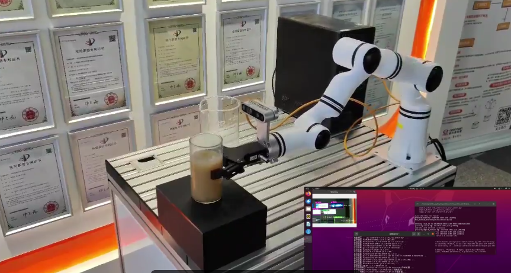

# YOLOV8 视觉识别功能包使用说明

## 1.项目概述

机械臂作为当前社会生产中必不可少的执行单元，已经融入到我们的各类生产生活中，如何让机械臂更加智能的执行任务是提高生产效率与生产智能化的持续目标，因此本项目为机械臂添加“眼睛”以增加机械臂的感知信息，并赋予”眼睛“识别周围环境信息的能力，以提升其执行智能化程度，为后续集成为机器人完成自动化生产任务提供基础。



### 1.1项目背景

机器人在传统应用中多以执行器的角色被使用，例如机械臂在流水线上以固定姿态顺序操作工件，这就使得其姿态设定必须非常精确严格，并且工作过程中出现任何偏移都会打乱整个流程，导致巨大的损失。为使机器人能够更加智能的对目标物体进行操作，就需要赋予机器人以视觉，传统的工业相机能够提供物体的轮廓颜色等信息，满足部分工厂生产条件，但由于其无法理解物体的语义信息，导致无法走出工厂，为日常生活提供智慧服务。

深度学习的出现加速了机器人进行图像理解，依据各种算法，已经能从二维图像获取高级语义信息，极大地帮助机器人理解周围环境。YOLOv8（You Only Look Once version 8）是一个深度学习框架，用于实现实时对象检测。它是 YOLO 系列的最新迭代，旨在提供更高的准确性和速度。其特点如下：

- **实时性能**: YOLOv8 继续保持 YOLO 系列的实时检测特性，即使在较低的硬件配置上也能达到很高的帧率（FPS）。
- **高准确度**: 通过更深更复杂的网络结构和改进的训练技巧，YOLOv8 在保持高速度的同时，也大幅提高了检测的准确度。
- **多尺度预测**: YOLOv8 引入了改进的多尺度预测技术，可以更好地检测不同大小的对象。
- **自适应锚框**: 新版在自适应调整锚框方面做了优化，可以更准确地预测对象的位置和大小。

通过YOLOV8赋能机器人，是当前机器人智能化进程的通用做法，而ROS操作系统作为当前使用最广泛的机器人操作系统，基于其点对点设计以及服务和节点管理器等机制，能够分散由计算机视觉和语音识别等功能带来的实时计算压力，能够适应多机器人遇到的挑战。基于以上背景制作了YOLOV8的视觉功能包，方便开发者在ROS中获取视觉信息。

### 1.2主要目标

- **视觉识别功能集成**：将视觉识别算法与机械臂执行功能集成，完成信息互通。
- **智能执行**：通过视觉识别的信息，让机械臂运动到指定位置，并抓取指定物体。

### 1.3核心功能

- **视觉识别物体信息发布**：将经过视觉识别算法得到的物体信息通过ROS话题发布，方便用户直接调用。
- **多类型轨迹执行**：机械臂有多种轨迹规划算法，能够让机械臂通过不同的运动方式到达目标点，保护设备不受损坏。

### 1.4技术亮点

- **高性能机械臂**：睿尔曼RM65机械臂以其6自由度和5kg负载能力，提供广泛的操作范围和高精度作业能力。
- **基于ROS的软件架构**：采用ROS noetic版本，构建模块化、可扩展的软件系统，支持二次开发和功能扩展。

### 1.5应用前景

该视觉识别抓取系统能够快速集成到各类机器人上，方便完成如无人商超、智慧农业等指定场景功能需求。

### 1.6更新日志

|  更新日期  |         更新内容         | 版本号 |
| :--------: | :----------------------: | :----: |
| 2024/12/27 | YOLOV8视觉识别功能包发布 | v1.0.0 |

## 2.软硬件概述

### 2.1工程结构

YOLOV8 视觉识别功能包基于RM产品开发，利用YOLOV8和D435相机视觉识别物体，得到物体的三维坐标，最终让RM机械臂完成一个抓取动作。使用此功能包仅仅需要将之加入原RM产品的功能包之中，编译通过后即可使用，提供单机械臂抓取水瓶并倒水的demo。

```
​```
│  requirements.txt                             //功能包依赖环境
│  YOLOV8 视觉识别功能包使用说明.md
│
├─pic
│      435测试画面.png
│      抓取.png
│      抓取流程.png
│      硬件连接.jpg
│      视觉臂.png
│
├─rm_robot                                      //机械臂ROS包，详细说明参考机械臂板块
│
├─vi_grab                                       //视觉抓取功能包
│  │  CMakeLists.txt
│  │  package.xml
│  │
│  ├─include
│  │  └─vi_grab
│  ├─launch
│  │      vi_grab_demo.launch                    //视觉抓取demo启动文件
│  │
│  ├─model
│  ├─scripts
│  │  │  LICENSE
│  │  │  pub.py
│  │  │  vision_grab.py                          //视觉抓取执行文件
│  │  │  vision_pour_water_modbus.py
│  │  │  vi_catch_yolov8.py                      //YOLOV8视觉检测ROS发布节点
│  │  │
│  │  └─.idea
│  │      │  .gitignore
│  │      │  .name
│  │      │  misc.xml
│  │      │  modules.xml
│  │      │  scripts.iml
│  │      │  vcs.xml
│  │      │  workspace.xml
│  │      │
│  │      └─inspectionProfiles
│  │              profiles_settings.xml
│  │              Project_Default.xml
│  │
│  └─src
└─vi_msgs
    │  CMakeLists.txt
    │  package.xml
    │
    ├─include
    │  └─vi_msgs
    ├─msg
    │      ObjectInfo.msg                           //YOLOV8检测物体话题消息类型
    │
    └─src

\```
```

### 2.2硬件配置

硬件采用RM65系列机械臂，intel realsense D435相机及因时EG2-4C2两指电动夹爪，机械臂可以是RM65-B带视觉转接板版本，也可以是RM65-B-V视觉版机械臂（如下图，内部走线集成D435相机），主控采用arm或者X86架构的PC均可。


机械臂通过网线连接主控，相机通过数据线接到主控的USB接口，夹爪由RM特制的末端接口线与机械臂末端连接。RM机械臂末端通信接口是一个6芯的连接器，它为连接到机器人的不同夹持器和传感器提供电源和控制信号。因此可以替换不同的末端执行器，集成时请参考RM机械臂二次开发手册。


## 3.功能包测试环境

### 3.1.ROS noetic 环境

ROS环境安装可以参考：[ROS的最简单安装——鱼香一键安装_鱼香ros一键安装-CSDN博客](https://blog.csdn.net/m0_73745340/article/details/135281023)

```
wget http://fishros.com/install -O fishros && . fishros
```

### 3.2.Ubuntu20.04系统

本功能包示例使用安装好jatpack的jetson xariver NX，cuda

Jetson NX刷机安装cuda等深度学习环境可以参考[英伟达官方源Jetson Xavier NX安装Ubuntu20.04，配置CUDA，cuDNN，Pytorch等环境教程](https://blog.csdn.net/m0_53717069/article/details/128536837)

### 3.3.YOLOV8 依赖需求

YOLOV8 官方对于python版本要求是3.8以上，因此安装好基本环境后，需要建立python3.8的环境（可以是conda虚拟环境，也可以使用系统自带的3.8环境）

设置好python3.8环境后，在该环境下进行以下步骤，在src下打开终端，根据requirements.txt安装python三方库

```
pip3 install -r requirements.txt
```

```
pip3 install ultralytics
```

### 3.4.RealSense D435 驱动以及pyrealsense2

1.注册服务器的公钥

```
sudo apt-get update && sudo apt-get upgrade && sudo apt-get dist-upgrade
sudo apt-key adv --keyserver keyserver.ubuntu.com --recv-key F6E65AC044F831AC80A06380C8B3A55A6F3EFCDE || sudo apt-key adv --keyserver hkp://keyserver.ubuntu.com:80 --recv-key F6E65AC044F831AC80A06380C8B3A55A6F3EFCDE
```

2.将服务器添加到存储库列表中

```
sudo add-apt-repository "deb https://librealsense.intel.com/Debian/apt-repo $(lsb_release -cs) main" -u
```

3.安装SDK2

```
sudo apt-get install librealsense2-dkms
sudo apt-get install librealsense2-utils
```

此步骤在arm架构上可能会报错，若没有报错则可以直接进入测试realsense-viewer步骤，如果报错可以采用源码安装的方式，首先下载源码与安装必要库

```
git clone https://github.com/IntelRealSense/librealsense.git
sudo apt-get install libusb-1.0-0-dev libglfw3-dev libgtk-3-dev
```

然后进入该目录，运行下列指令安装和编译依赖项：

```
sudo apt-get install libudev-dev pkg-config libgtk-3-dev
sudo apt-get install libusb-1.0-0-dev pkg-config
sudo apt-get install libglfw3-dev
sudo apt-get install libssl-dev

sudo cp config/99-realsense-libusb.rules /etc/udev/rules.d/
sudo udevadm control --reload-rules && udevadm trigger 
mkdir build
cd build
cmake ../ -DBUILD_EXAMPLES=true
make
sudo make install
```

4.测试安装结果

```
realsense-viewer
```


5.安装pyrealsense2

```
python -m pip install --upgrade pip
pip install pyrealsense2 -i https://pypi.tuna.tsinghua.edu.cn/simple/
```

## 4.测试步骤

1.首先确认机械臂ROS功能包是否可以正常使用，因为ROS功能包与机械臂的版本存在对应关系，可以进入[realman资料官网](https://develop.realman-robotics.com/robot/summarize/)查看具体版本对应信息。若ROS包存在问题，请下载官网最新的ROS包替换src目录下的rm_robot。

```
sudo apt-get update    # 更新在线包列表
sudo apt-get install python-catkin-tools    # 安装catkin
```

```
mkdir -p rm_work    # 创建功能包
cd rm_work    # 进入工作空间目录
```

将下载好的src解压后放到rm_work目录下

2.编译vi_msgs、rm_msgs

```
catkin build vi_msgs rm_msgs
```

vi_msgs下的ObjectInfo定义的物体信息如下

```
string object_class                //物体类别
float64 x                          //物体距离相机坐标系的X轴值
float64 y                          //物体距离相机坐标系的Y轴值
float64 z                          //物体距离相机坐标系的Z轴值
```

3.功能包整体编译

```
catkin build 
```

4.运行 vi_grab_demo.launch 

 vi_grab_demo.launch  里一共启动了四个节点，分别是msg_pub（主动获取机械臂状态）、robot_driver（机械臂功能启动）、object_detect（视觉识别信息发布）、object_catch（抓取任务脚本）。

```
# 声明环境变量
source devel/setup.bash 
# 运行launch文件
roslaunch vi_grab vi_grab_demo.launch 
```

5.发布需要抓取的物体

发布物体信息之前，需要先手动将机械臂示教到初始位置，因为抓取逻辑是在当前机械臂状态下识别物体，并根据当前的末端姿态去抓取物体，也就是说需要机械臂尽可能保持末端姿态水平。

打开终端，在终端通过rostopic pub 发布你想抓取的物体名字（使用的是coco模型），例如抓取水瓶就是

```
rostopic pub /choice_object std_msgs/String "bottle"
```

6.机械臂接收到需要抓取物体的信息，开始执行vision_grab.py文件里的运动逻辑，以下是逻辑流程图


## 5.关键代码解析

视觉功能包是建立了一个ROS节点，用于发布YOLOV8的视觉识别结果，用户可以基于此节点进行多种二次开发，只需要将功能包放入原先的工作空间即可。在RM产品中，我们通过订阅物体信息话题，将物体信息转换到RM机械臂的坐标系下，完成视觉抓取等功能。

### 5.1视觉识别及信息发布

```
model_path = os.path.join('model', 'yolov8n.pt')
model = YOLO('model_path')  #通过加载不同的模型，使用yolov8的不同模式，例如yolov8n-pose.pt是人体姿态识别模式，yolov8n.pt是普通检测框模式
rospy.init_node("object_detect",anonymous=True)   #建立ROS节点
object_pub = rospy.Publisher("object_pose",ObjectInfo,queue_size=10)   #定义话题发布器
# 循环检测图像流
try:
    while True:
        # 等待获取一对连续的帧：深度和颜色
        intr, depth_intrin, color_image, depth_image, aligned_depth_frame = get_aligned_images()
        if not depth_image.any() or not color_image.any():
            continue
        # 使用 YOLOv8 进行目标检测
        results = model.predict(color_image, conf=0.5)
        detected_boxes = results[0].boxes.xyxy  # 获取边界框坐标
        data = results[0].boxes.data.cpu().tolist()
        canvas = results[0].plot()

        for i, (row, box) in enumerate(zip(data, detected_boxes)):
            id = int(row[5])
            name = results[0].names[id]
            x1, y1, x2, y2 = map(int, box)  # 获取边界框坐标
            # 显示中心点坐标
            ux = int((x1 + x2) / 2)
            uy = int((y1 + y2) / 2)
            dis, camera_coordinate = get_3d_camera_coordinate([ux, uy], aligned_depth_frame, depth_intrin) #得到中心点的深度值，当作距离

            formatted_camera_coordinate = f"({camera_coordinate[0]:.2f}, {camera_coordinate[1]:.2f},{camera_coordinate[2]:.2f})"
            # 展示检测界面
            cv2.circle(canvas, (ux, uy), 4, (255, 255, 255), 5)
            cv2.putText(canvas, str(formatted_camera_coordinate), (ux + 20, uy + 10), 0, 1,
                        [225, 255, 255], thickness=2, lineType=cv2.LINE_AA)
            # ROS话题发送物体坐标
            object_info_msg.object_class = str(name)
            object_info_msg.x = float(camera_coordinate[0])
            object_info_msg.y = float(camera_coordinate[1])
            object_info_msg.z = float(camera_coordinate[2])
            rospy.loginfo(object_info_msg)
            object_pub.publish(object_info_msg)

        cv2.namedWindow('detection', flags=cv2.WINDOW_NORMAL |
                                               cv2.WINDOW_KEEPRATIO | cv2.WINDOW_GUI_EXPANDED)
        cv2.imshow('detection', canvas)
        key = cv2.waitKey(1)
        # 按下 esc 或者 'q' 退出程序和图像界面
        if key & 0xFF == ord('q') or key == 27:
            cv2.destroyAllWindows()
            break 
finally:
    # 关闭相机图像流
    pipeline.stop()
```

### 5.2坐标转换

物体在相机坐标系下的三维坐标转换到机械臂基坐标系下的坐标函数：

```
def convert(x,y,z,x1,y1,z1,rx,ry,rz):
    """
    函数功能：我们需要将旋转向量和平移向量转换为齐次变换矩阵，然后使用深度相机识别到的物体坐标（x, y, z）和
    机械臂末端的位姿（x1,y1,z1,rx,ry,rz）来计算物体相对于机械臂基座的位姿（x, y, z, rx, ry, rz）
    输入参数：深度相机识别到的物体坐标（x, y, z）和机械臂末端的位姿（x1,y1,z1,rx,ry,rz）
    返回值：物体在机械臂基座坐标系下的位置（x, y, z）
    """
    global rotation_matrix,translation_vector
    obj_camera_coordinates = np.array([x, y, z])

    # 机械臂末端的位姿，单位为弧度
    end_effector_pose = np.array([x1, y1, z1,
                                  rx, ry, rz])
    # 将旋转矩阵和平移向量转换为齐次变换矩阵
    T_camera_to_end_effector = np.eye(4)
    T_camera_to_end_effector[:3, :3] = rotation_matrix
    T_camera_to_end_effector[:3, 3] = translation_vector
    # 机械臂末端的位姿转换为齐次变换矩阵
    position = end_effector_pose[:3]
    orientation = R.from_euler('xyz', end_effector_pose[3:], degrees=False).as_matrix()
    T_base_to_end_effector = np.eye(4)
    T_base_to_end_effector[:3, :3] = orientation
    T_base_to_end_effector[:3, 3] = position
    # 计算物体相对于机械臂基座的位姿
    obj_camera_coordinates_homo = np.append(obj_camera_coordinates, [1])  # 将物体坐标转换为齐次坐标
    #obj_end_effector_coordinates_homo = np.linalg.inv(T_camera_to_end_effector).dot(obj_camera_coordinates_homo)
    obj_end_effector_coordinates_homo = T_camera_to_end_effector.dot(obj_camera_coordinates_homo)
    obj_base_coordinates_homo = T_base_to_end_effector.dot(obj_end_effector_coordinates_homo)
    obj_base_coordinates = obj_base_coordinates_homo[:3]  # 从齐次坐标中提取物体的x, y, z坐标
    # 计算物体的旋转
    obj_orientation_matrix = T_base_to_end_effector[:3, :3].dot(rotation_matrix)
    obj_orientation_euler = R.from_matrix(obj_orientation_matrix).as_euler('xyz', degrees=False)
    # 组合结果
    obj_base_pose = np.hstack((obj_base_coordinates, obj_orientation_euler))
    obj_base_pose[3:] = rx,ry,rz
    return obj_base_pose
```

等待接收choice_object话题信息，如果一直没有向choice_object话题发布信息，则持续等待。

```
object_msg = rospy.wait_for_message('/choice_object', String, timeout=None)
```

### 5.3回调函数

接收到指定的抓取物体信号，进入回调函数，若匹配指定物体，则进入catch抓取逻辑。

```
def object_pose_callback(data):
    """
    函数功能：每帧图像经过识别后的回调函数，若有抓取指令，则判断当前画面帧中是否有被抓物体，如果有则将物体坐标进行转换，并让机械臂执行抓取动作
    输入参数：无
    返回值：无
    """

    # 判断当前帧的识别结果是否有要抓取的物体
    if data.object_class == object_msg.data and len(object_msg.data) > 0 :

        # 等待当前的机械臂位姿
        arm_pose_msg = rospy.wait_for_message("/rm_driver/Arm_Current_State", Arm_Current_State, timeout=None)
        print(arm_pose_msg)
        rospy.sleep(1)
        # 等待接收当前机械臂位姿四元数形式
        arm_orientation_msg = rospy.wait_for_message("/rm_driver/ArmCurrentState", ArmState, timeout=None)
        print(arm_orientation_msg)
        # 计算机械臂基坐标系下的物体坐标
        result = convert(data.x,data.y,data.z,arm_pose_msg.Pose[0],arm_pose_msg.Pose[1],arm_pose_msg.Pose[2],arm_pose_msg.Pose[3],arm_pose_msg.Pose[4],arm_pose_msg.Pose[5])
        print(data.object_class,':',result)
        # 抓取物体
        catch(result,arm_orientation_msg)
        # 清除object_msg的信息，之后二次发布抓取物体信息可以再执行
        object_msg.data = ''
```

### 5.4抓取逻辑

抓取逻辑中，需要针对目标位置对机械臂执行轨迹进行分段，例如第一段应该是机械臂先到达物体前方，第二段才是去抓取，这样能够避免轨迹与物体碰撞，在代码中第一个movejp_type到达物体前7厘米处（假如物体在机械臂基坐标系的X轴负方向）

```
def catch(result,arm_orientation_msg):
    '''
    函数功能：机械臂执行抓取动作
    输入参数：经过convert函数转换得到的‘result’和机械臂当前的四元数位姿‘arm_orientation_msg’
    返回值：无
    '''
    # 上一步通过pic_joint运动到了识别较好的姿态，然后就开始抓取流程
    # 流程第一步：经过convert转换后，得到了机械臂坐标系下的物体位置坐标result，通过movej_p运动到result目标附近，因为不能一下就到达
    movejp_type([result[0]-0.07,result[1],result[2],arm_orientation_msg.Pose.orientation.x,arm_orientation_msg.Pose.orientation.y,
                 arm_orientation_msg.Pose.orientation.z,arm_orientation_msg.Pose.orientation.w],0.3)
    print('*************************catching  step1*************************')

    # 抓取第二步：通过抓取第一步已经到达了物体前方，后续使用movel运动方式让机械臂直线运动到物体坐标处
    movel_type([result[0],result[1],result[2],arm_orientation_msg.Pose.orientation.x,arm_orientation_msg.Pose.orientation.y,
                 arm_orientation_msg.Pose.orientation.z,arm_orientation_msg.Pose.orientation.w],0.3)
    print('*************************catching  step2*************************')

    # 抓取第三步：到达目标处，闭合夹爪
    gripper_close()
    print('*************************catching  step3*************************')

    # 倒水第一步：抬起物体5厘米
    movel_type([result[0],result[1],result[2]+0.05,arm_orientation_msg.Pose.orientation.x,arm_orientation_msg.Pose.orientation.y,
                 arm_orientation_msg.Pose.orientation.z,arm_orientation_msg.Pose.orientation.w],0.3)
    print('*************************pour  step1*************************')

    # 倒水第二步：旋转机械臂末端关节,通过给机械臂末端关节添加转动弧度达到倒水的动作示例
    movej_type([arm_orientation_msg.joint[0],arm_orientation_msg.joint[1],arm_orientation_msg.joint[2],arm_orientation_msg.joint[3],
                arm_orientation_msg.joint[4],arm_orientation_msg.joint[5]+1],0.3)
    print('*************************pour  step2*************************')
```


## 6.更新步骤

整个工程分为两部分，一个是机械臂ROS部分，一个是视觉检测部分，工程的整体逻辑就是在视觉检测部分引用机械臂ROS部分控制机械臂完成基于视觉的一系列运动。由于机械臂本体软件版本和ROS包版本存在对应关系，因此当机械臂硬件版本更新，可能会导致ROS包无法正常使用，这时候需要对工程中的ROS包进行更新。

更新步骤为：

```
1、官网下载最新的机械臂ROS包

2、替换工程中的rm_robot文件夹

3、重新编译rm_robot

4、将vision_grab脚本中的机械臂控制话题改为和最新的机械臂ROS包中一致

5、运行测试
```


# 常见问题

## 1.网络通信问题


此错误将导致无法通过话题读取机械臂当前状态信息，因此不可忽略。应当修改网络设置。

例如在虚拟机上使用此demo，采用NAT连接方式时，就会出现UDP上报不了数据的情况，当虚拟机采用nat模式时，由于虚拟机与主机之间通过地址转换模式进行连接，此时在主机中维护了一张地址转换表，所以虚拟机可以通过主机访问到外部网络，外部网络是需要通过地址转换表来找到虚拟机的。而地址转换表是会更新的，因为它要解除一些端口的占用，所以就会造成当等到时间过长时，此时地址转换表已经更新，udp数据包无法发送至正确的地址，所以就会造成客户端udp无法正常接收数据。

因此使用虚拟机时需要将网络模式设置为桥接模式，才可以接收UDP数据。

## 2.抓取问题

如果在实际使用中，发现抓取不准，可以通过两个方面判断原因，一个是手眼标定结果是否正确，另外一个是物体坐标是否正确，比如识别的时候由于模型和光线的原因，会导致识别的坐标为0，0，0的情况出现，这样经过解算后的机械臂到达位置肯定就不正确，因此需要保证物体识别在初始姿态下拥有较好的效果。